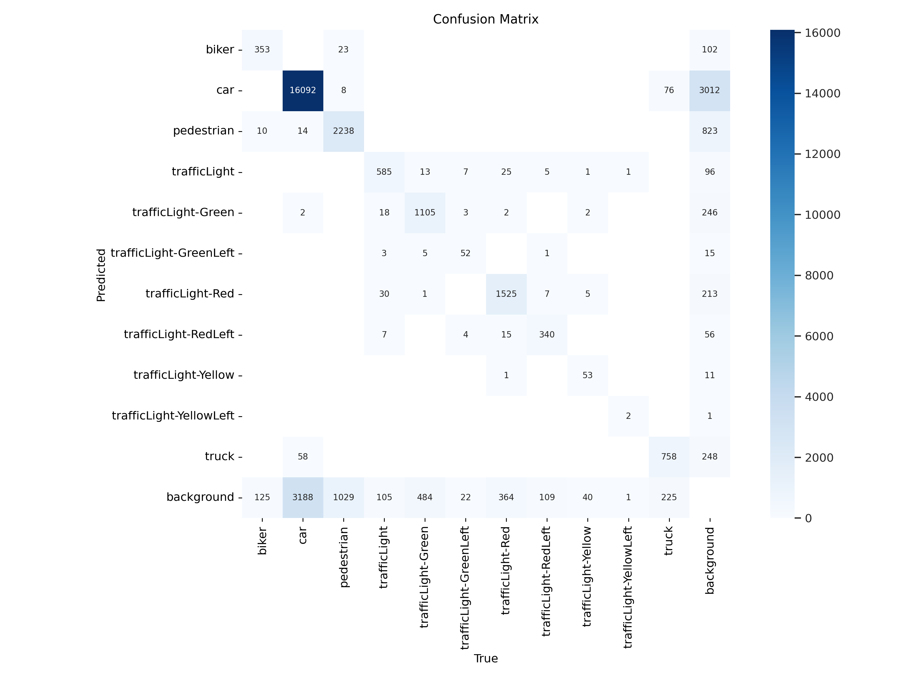
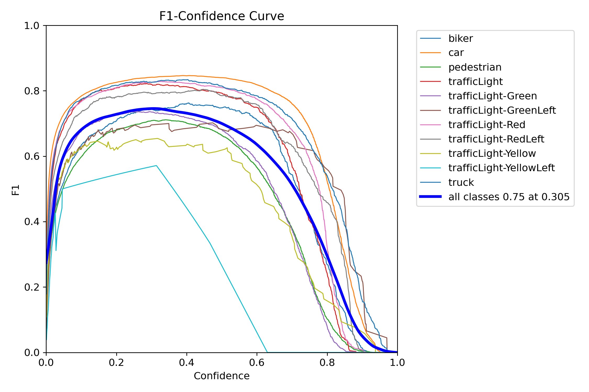

<!DOCTYPE html>
<html lang="en">
<head>
  <meta charset="UTF-8" />
</head>
<body>
  <h1>🚀 YOLOv8: Cutting-Edge Object Detection</h1>
  

    
  

  

    <a href="https://github.com/ultralytics/ultralytics">Ultralytics YOLOv8</a> is a fast, accurate, and easy-to-use model for object detection, segmentation, and classification, building on years of YOLO advancements.
  

  <h2>🚗 Real-Time Object Detection in Autonomous Vehicles using YOLOv8</h2>

  <h3>📌 Project Overview</h3>
  

    Utilizes <strong>YOLOv8</strong> for <strong>real-time detection of vehicles, pedestrians, and traffic signals etc</strong> in autonomous vehicle settings, enhancing road safety with practical computer vision deployment.
  

  <h3>📂 Dataset</h3>
  

    This project uses a <strong>Roboflow-hosted self-driving car dataset</strong> containing images and annotations for cars, pedestrians, and traffic signals. The dataset was integrated using the Roboflow API, ensuring organized, version-controlled, and YOLOv8-ready dataset management for effective training and validation.
  

  <h3>🛠️ Installation</h3>
  <pre><code>pip install ultralytics roboflow</code></pre>

  <h3>⚡ Quick Usage</h3>
  <pre><code>yolo detect train data=data.yaml model=yolov8n.pt epochs=50 imgsz=640</code></pre>
  
For detailed exploration, see the <a href="https://github.com/srdhanief/Real-Time-Object-Detection-in-Autonomous-Vehicles-using-YOLOv8/blob/main/Real_Time_Detection_in_Autonomous_Vehicles_YOLOv8.ipynb">project notebook</a>.

  <h3>📈 Results</h3>
  
✅ Effective real-time detection of road objects.

  
✅ Evaluation metrics:

  

    
    
  

  <ul>
    <li><strong>Confusion Matrix:</strong> Shows the performance of the model by comparing predicted classes with true classes.</li>
    <li><strong>F1 Curve:</strong> Displays the balance between precision and recall, indicating the model's accuracy across thresholds.</li>
  </ul>

  <h3>📜 License</h3>
  
MIT License

  

  
<em>⚡ Powered by YOLOv8</em>

</body>
</html>
